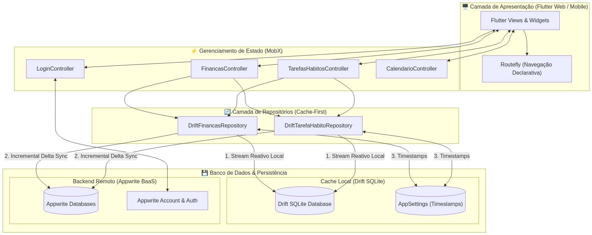

# PPVDigital - Projeto Pessoal de Vida (Digital)


-lightgrey)


O **PPVDigital** é uma plataforma completa desenvolvida em Flutter (Web/Mobile) para planejamento pessoal, acompanhamento de hábitos, gestão de tarefas e controle financeiro pessoal e compartilhado. O projeto traz para o formato digital o conceito do **Projeto Pessoal de Vida (PPV)**, com foco em capacitação, acompanhamento de métricas e funcionamento offline transparente.

---

## 🏗️ Arquitetura da Aplicação

A aplicação adota uma arquitetura reativa, offline-first e modularizada por contextos de uso (`capacitacao`, `financas`, `tarefas_habitos`, `login`).



### Principais Tecnologias e Bibliotecas

- **Framework**: [Flutter](https://flutter.dev) (gerenciado via **FVM** - Flutter Version Manager).
- **Gerenciamento de Estado**: [MobX](https://pub.dev/packages/mobx) e `flutter_mobx` utilizando reatividade com instanciações manuais (`mobx.Observable`), getters com baixa alocação e mutações seguras via `mobx.runInAction()`.
- **Banco de Dados Local & Cache Offline**: [Drift](https://drift.simonbinder.eu/) (SQLite reativo **Schema v6** com índices compostos em colunas críticas como `remoteId`, `usuarioId`, `dataCompetencia`, `agendamento`), permitindo consultas ultrarrápidas sem dependência imediata de rede e isolamento atômico de dados por usuário (`clearAllUserData()`).
- **Backend & Backend-as-a-Service (BaaS)**: [Appwrite SDK](https://appwrite.io), gerenciando autenticação, sessões, persistência remota e **Appwrite Realtime (WebSockets)** escopado por usuário para sincronização instantânea inter-dispositivos.
- **Serverless Functions**: Função Go 1.26 (`functions/process_recurrent_transactions`) para processamento automatizado de transações recorrentes indeterminadas.
- **Arquitetura Híbrida de Sincronização**: Combinação de mutações REST API, canal Realtime Pub/Sub WebSocket para atualizações ativas, e **Delta Sync com Projeção Leve de IDs** (`Query.select(['$id'])`) para reconciliação de exclusões sem consumo desnecessário de tráfego de rede ao retomar o foco (`AppLifecycleState.resumed`).
- **Domínio e Tipagem Forte**: Enums tipados do Dart 3 (`TipoTransacao`, `TipoItem`, `TipoHabito`, `TipoRecorrencia`) e desacoplamento de regras puras com `RecorrenciaService` via *switch expressions*.
- **Roteamento Baseado em Arquivos**: [Routefly](https://github.com/wladrbarbosa/routefly) para navegação declarativa baseada na estrutura do sistema de arquivos.
- **Visualização de Dados**: `fl_chart`, `timeline_tile`, `flutter_animation_progress_bar` e `syncfusion_flutter_calendar`.

---

## 📋 Regras de Negócio e Módulos

### 💵 1. Módulo de Finanças

O módulo financeiro permite controlar contas, categorias, lançamentos individuais, transferências e despesas compartilhadas.

#### Tipos de Transação
- **Receita**: Incremente no saldo das contas afetadas.
- **Despesa**: Débito no saldo das contas afetadas.
- **Transferência**: Débito na conta de origem e crédito na conta de destino, com impacto neutro no patrimônio total.

#### Isolamento Estrito de Transações por Contas do Usuário
- Consultas locais (`getTransacoes`, `watchTransacoes`) no Drift SQLite filtram estritamente por contas pertencentes ao usuário autenticado (`t.contaId.isIn(userContaIds) | t.contaDestinoId.isIn(userContaIds)`), impedindo vazamento de dados locais entre contas não autorizadas.
- Eventos de Realtime WebSockets (`handleRealtimeEvent`) descartam automaticamente inserções/atualizações de transações cujas contas não pertençam ao usuário ativo.

#### Divisão por Pesos entre Contatos (`DivisaoTransacaoModel`)
- Suporta a divisão proporcional de uma despesa/receita entre múltiplos contatos.
- Cada divisão possui um `peso` relativo. A parcela de cada participante é calculada via:
  $$\text{Valor do Contato} = \text{Valor Total} \times \left( \frac{\text{Peso do Contato}}{\sum \text{Pesos}} \right)$$
- Se nenhuma divisão for cadastrada, o valor é atribuído 100% ao responsável pela conta.

#### Recorrência e Parcelamentos (`RecorrenciaService` & `TransacaoRecorrenciaModel`)
- Suporta frequências **diária**, **semanal**, **mensal** e **anual** calculadas pelo serviço desacoplado de domínio `RecorrenciaService`.
- Cálculo automático das datas de competência de cada parcela com tratamento para anos bissextos e bordas de meses.
- Permite número fixo de parcelas (`totalParcelas`) ou recorrência indeterminada (`fimRecorrencia`).
- Atualizações em série permitem propagação em lote para transações futuras da mesma recorrência.

#### Métricas Mensais e Consolidação
- **`saldoAnterior`**: Soma das transações consolidadas ocorridas estritamente antes do mês selecionado.
- **`receitaMes` / `despesaMes`**: Soma das transações do mês exibido.
- **`saldoAtual`**: Saldo acumulado (Saldo Anterior + Receitas do Mês - Despesas do Mês).
- **Consolidação (`consolidada`)**: Transações consolidadas refletem o saldo real efetivado; transações não consolidadas alimentam as projeções financeiras.

---

### 🎯 2. Módulo de Tarefas e Hábitos

Acompanhamento do desenvolvimento pessoal através da criação e monitoramento de hábitos e execução de tarefas.

#### Hábitos Positivos vs. Hábitos Negativos
- **Hábitos Positivos (Construir)**: Hábitos com valores positivos que aumentam o progresso executado e possuem configuração de janelas de reinício e ciclos periódicos.
- **Hábitos Negativos (Parar / Abstinência)**: Hábitos destinados a interromper comportamentos indesejados.
  - Possuem valor multiplicador negativo (reduzem o progresso no `DashboardLogic`).
  - Utilizam o campo `metaVezes` para registrar a **Meta de dias sem praticar** (abstinência).
  - Cálculo automático de **dias sem praticar** baseado no intervalo entre o último registro de recaída no histórico (ou criação) e o dia atual.
  - **Visualização Visual Diferenciada**: Cards em cor contrastante (`Colors.deepOrange`), com indicador líquido que se inicia vazio (0%) e se preenche gradualmente com os dias sem praticar até atingir 100% na meta de dias.
  - **Registro de Recaída**: Botão de ação dedicado com ícone de alerta e diálogo de confirmação explicativo antes de registrar a recaída e reiniciar a contagem.
  - **Ordenação**: Suporte a ordenação dinâmica de hábitos por tipo (`Positivos / Negativos`).

#### Tarefas e Hábitos Arquivados (`arquivado`)
- Campo booleano `arquivado` suportado em Drift SQLite (Schema v5) e Appwrite API.
- Itens arquivados não aparecem na listagem padrão nem alimentam os cálculos do dashboard ativo.
- Disponível visualização dedicada de itens arquivados através de botão alternador na tela de listagem de hábitos e tarefas.

#### Janelas de Reinício e Frequência de Hábitos
- Configuração de ciclos de reinício por **dias**, **semanas**, **meses** ou **anos**.
- Extensão `toTarefaHabitoQtdModelList` calcula automaticamente o total de execuções dentro da janela ativa.
- **Métrica de Progresso**:
  $$\text{vezesPraticado} = \text{Quantidade de Históricos na Janela} \times \text{Valor Multiplicador}$$
- **Meta Atingida**: Hábito considerado concluído no ciclo quando $\text{vezesPraticado} \ge \text{metaVezes}$.

#### Matriz de Calendário, Histórico e Cache Reativo
- Matriz dinâmica de dias (35 ou 42 células) gerada pelo `CalendarioController` exibindo o preenchimento dos dias vizinhos.
- Histórico imutável de execuções (`HistoricoItemModel`) registrado no banco local e sincronizado remotamente.
- **Cache-First, Delta Sync & Realtime WebSockets**: Renderização instantânea dos hábitos e tarefas diretamente do Drift SQLite, com atualização em tempo real via WebSockets (`AppwriteRealtimeService`), reconciliação de itens excluídos remotamente e sincronização incremental em segundo plano filtrando registros alterados via `$updatedAt` e timestamps salvos em `AppSettings`.

#### Métricas e Gráficos do Dashboard (`DashboardLogic`)
- **Tempo Comprometido vs Disponível**:
  - **Tempo Disponível**: Capacidade total em minutos por ciclo:
    - **Dia**: $24\text{h} = 1.440\text{ min}$
    - **Semana**: $7 \times 24\text{h} = 10.080\text{ min}$
    - **Mês**: $\text{diasNoMês} \times 1.440\text{ min}$ (dinâmico: 28, 29, 30 ou 31 dias)
    - **Ano**: $\text{diasNoAno} \times 1.440\text{ min}$ ($525.600\text{ min}$ ou $527.040\text{ min}$ em anos bissextos)
  - **Tempo Previsto (Comprometido)**: Calculado exclusivamente sobre **hábitos** (`item.tipo == 'habito'`) com duração válida:
    $$\text{Minutos Base} = \frac{\text{duration} \times \text{metaVezes}}{\text{reiniciaEmQtd}}$$
    Convertido proporcionalmente para os 4 ciclos (Dia, Semana, Mês e Ano) de acordo com a frequência base do hábito.
  - **Tempo Executado**: Soma os minutos registrados em `HistoricoItemModel` dentro dos limites exatos do ciclo corrente (`startOfDay..endOfDay`, `startOfWeek..endOfWeek`, `startOfMonth..endOfMonth`, `startOfYear..endOfYear`).
- **% Meta por Categoria**:
  - **Metas**: Calculadas estritamente a partir de hábitos (tarefas não entram na meta).
  - **Executado**: Contabiliza execuções de hábitos e tarefas concluídas na categoria durante o ciclo (com execuções de hábitos negativos reduzindo o progresso).

---

### 🔑 3. Módulo de Autenticação e Isolamento de Sessão

- Gerenciamento de sessão via `LoginController` integrado ao Appwrite `Account`.
- Persistência e restauração offline do perfil do usuário em `Drift SQLite` (`AppSettings`) para acesso sem conexão à internet.
- **Isolamento de Cache e Reset Multi-Usuário**: Ao efetuar logout (`signOut`) ou ao autenticar um usuário com `userId` diferente do anterior no mesmo dispositivo, o app executa a limpeza atômica de todas as tabelas locais do Drift (`clearAllUserData()`), reseta os timestamps de sincronização (`last_..._sync_time`) e zera o estado em memória dos controllers. Isso garante que o novo usuário realize uma sincronização inicial completa a partir do Appwrite, evitando vazamento de dados locais ou listas vazias por filtros de delta sync obsoletos.
- Validação estrita de e-mail e requisitos mínimos de senha.

---

## 🛠️ Diretrizes Técnicas do Projeto (AGENTS.md)

Para garantir consistência e alto desempenho, a codebase obedece às seguintes regras fundamentais:

1. **Flutter Version Manager (FVM)**:
   - Todos os comandos do SDK do Flutter **devem** ser prefixados por `fvm`. Exemplo: `fvm flutter run`, `fvm flutter test`.
2. **Projeções em Relacionamentos do Appwrite API (`Query.select`)**:
   - **É proibido** combinar a wildcard raiz `'*'` com wildcards de relacionamento (ex: `'conta.*'`). A combinação causa o retorno nulo de atributos raízes no Appwrite. O repositório deve listar explicitamente todos os atributos necessários:
     ```dart
     Query.select([
       'descricao',
       'valor',
       'tipo',
       'dataCompetencia',
       'consolidada',
       'conta.*',
       'contaDestino.*',
     ])
     ```
3. **Integridade de Cache Offline no Drift SQLite**:
   - Consultas leves (*lightweight*) ou parciais não podem sobrescrever dados completos já armazenados nas tabelas do Drift.
4. **Sincronização Não-Bloqueante (UI/UX)**:
   - A sincronização em segundo plano exibe um indicativo discreto (`LinearProgressIndicator`) no topo da tela, sem bloquear a interação do usuário com overlays de carregamento.

---

## 🧪 Suíte de Testes Automatizados

O projeto conta com uma suíte de testes unitários e de integração validando todas as regras de negócio:

### Executando os Testes

Para rodar todos os testes automatizados da aplicação:

```bash
fvm flutter test
```

### Estrutura dos Arquivos de Teste (`test/`)

- `test/business_logic/financas_business_test.dart`: Testes de cálculo de divisão por pesos, geração de datas recorrentes, transferências e resumos de saldo mensal.
- `test/business_logic/tarefas_habitos_business_test.dart`: Testes de janelas de reinício de hábitos, progresso de metas e matriz de calendário.
- `test/business_logic/login_business_test.dart`: Testes de validação de formulários e estados da sessão de autenticação.
- `test/business_logic/drift_cache_sync_test.dart`: Teste automatizado que varre a codebase para garantir que nenhuma consulta viole a regra do `Query.select()` do Appwrite, e teste de preservação do cache local Drift.
- `test/drift_financas_repository_test.dart`: Testes de integração das operações de finanças e realtime no banco SQLite local.
- `test/drift_tarefa_habito_repository_test.dart`: Testes de integração das operações de tarefas/hábitos e realtime no banco SQLite local.
- `test/unit/transaction_isolation_test.dart`: Testes unitários de isolamento de consultas e streams de transações por contas de usuário e descarte de eventos realtime de terceiros.
- `test/unit/negative_habits_test.dart`: Testes unitários do impacto negativo de hábitos no progresso do dashboard e distribuição de atenção.
- `test/unit/arquivado_tarefas_habitos_test.dart`: Testes unitários de serialização e persistência do campo `arquivado` em SQLite (v5).
- `test/unit/user_switch_cache_test.dart`: Testes unitários de isolamento multi-usuário, limpeza atômica do SQLite e reset completo de controllers MobX.
- `test/widget_test.dart`: Teste de fumaça de instanciação de widgets.

---

## 🚀 Como Executar o Projeto Localmente

### Pré-requisitos
1. [Flutter SDK](https://flutter.dev) (gerenciado via [FVM](https://fvm.app/)).
2. FVM instalado globalmente (`dart pub global activate fvm`).
3. Instância configurada do [Appwrite](https://appwrite.io) (ou credenciais `.env`).

### Passo a Passo

1. **Clonar o Repositório**:
   ```bash
   git clone https://github.com/wladrbarbosa/ppvdigital.git
   cd ppvdigital
   ```

2. **Instalar Dependências**:
   ```bash
   fvm flutter pub get
   ```

3. **Gerar Códigos (Drift e Roteamento)**:
   ```bash
   fvm flutter pub run build_runner build --delete-conflicting-outputs
   ```

4. **Configurar Variáveis de Ambiente**:
   Copie o arquivo `.env.example` para `.env` e preencha o Endpoint e Project ID do Appwrite:
   ```env
   APPWRITE_ENDPOINT=https://cloud.appwrite.io/v1
   APPWRITE_PROJECT_ID=seu_project_id
   ```

5. **Executar a Aplicação**:
   - **No Navegador (Web)**:
     ```bash
     fvm flutter run -d chrome
     ```
   - **No Dispositivo Móvel / Emulador**:
     ```bash
     fvm flutter run
     ```

---

## 📦 Deploy para Produção (Web)

O projeto inclui scripts automatizados de deploy em PowerShell e Bash para compilação PWA / Web:

- **Linux / macOS**:
  ```bash
  chmod +x deploy_web.sh
  ./deploy_web.sh
  ```
- **Windows (PowerShell)**:
  ```powershell
  .\deploy_web.ps1
  ```

---

## 📄 Licença

Este projeto está licenciado sob a licença MIT - veja o arquivo [LICENSE](LICENSE) para mais detalhes.
