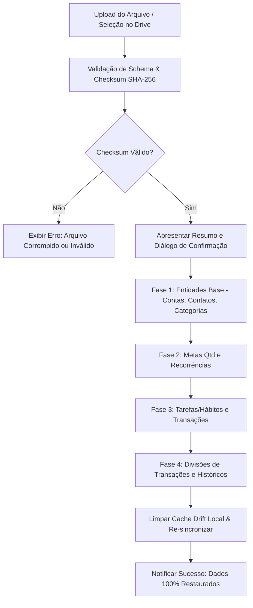

# Design Document: Backup & Restauração de Dados (Manual e Google Drive Automático)

Data: 2026-09-12  
Status: Em Planejamento  

## 1. Visão Geral e Contexto

O aplicativo **PPVDigital / Seapruma** gerencia dados críticos dos usuários distribuídos em 10 tabelas/coleções no Appwrite Database (`671f6e1600022832cba5`) com espelhamento local de alta performance em SQLite (via Drift).

Este documento projeta a arquitetura completa do subsistema de **Backup e Restauração de Dados**, acessível no menu de configurações da home (`ConfiguracoesModalWidget`). O sistema provê:
1. **Backup Manual:** Geração e download imediato de arquivo estruturado (`.json` ou `.ppvbackup`) contendo a totalidade dos dados do usuário logado.
2. **Backup Automático no Google Drive:** Envio diário programado do arquivo de backup para o Google Drive do usuário via escopo de menor privilégio (`drive.file`), com rotação inteligente (retenção dos últimos 30 dias).
3. **Restauração Segura com Integridade Referencial:** Validação prévia de checksum (SHA-256), reconstituição ordenada das dependências relacionais sem perda de dados e reconciliação imediata com o cache Drift local.
4. **Alta Performance & Integridade Absoluta:** Arquitetura de *Extração Direta e Paginada do Appwrite* (`Query.limit(5000)` com cursores), garantindo que 100% dos dados históricos do usuário (inclusive transações de anos e meses não navegados no dispositivo) sejam exportados sem depender do cache parcial do Drift, enriquecendo o SQLite local ao término da exportação.

---

## 2. Escopo dos Dados do Usuário (10 Tabelas no Appwrite)

Todas as entidades vinculadas ao `userId` do usuário autenticado são cobertas pelo backup:

| # | Tabela / Coleção | Identificador Appwrite | Vínculo com Usuário | Dependências / Chaves Estrangeiras |
|---|---|---|---|---|
| 1 | `contas` | `671f7aa70014dda7507c` | `userId == user.$id` | Nenhuma (independente) |
| 2 | `contatos` | `contatos` | `ownerId == user.$id` | Nenhuma (independente) |
| 3 | `categorias_transacoes` | `categorias_transacoes` | `userId == user.$id` | Nenhuma (independente) |
| 4 | `categoriasTarefasHabitos` | `671f8803003d7d827ea8` | `usuario == user.$id` | Nenhuma (independente) |
| 5 | `tarefasHabitosQtds` | `674cfd5e001a6582741e` | `usuario == user.$id` | `categoriasTarefasHabitos` |
| 6 | `transacao_recorrencia` | `transacao_recorrencia` | Vinculada às transações do usuário | `transacao` |
| 7 | `tarefasEHabitos` | `671f864f0023d1c27de8` | `usuario == user.$id` | Lista de `tarefasHabitosQtds` |
| 8 | `transacoes` | `671f7a6f000cb3ab17b9` | `conta.userId == user.$id` | `conta`, `contaDestino`, `categoria`, `recorrencia`, `devedorContato`, `credorContato` |
| 9 | `divisao_transacoes` | `divisao_transacoes` | Vinculada a transações do usuário | `transacao`, `categoria` |
| 10 | `historicoTarefasHabitos` | `6741f10d000d985e4af9` | `usuario == user.$id` | `tarefasEHabitos` |

> [!IMPORTANT]
> **Cobertura Temporal Irrestrita (Passado, Presente e Futuro):**
> No módulo de finanças, usuários possuem lançamentos parcelados, compras agendadas, contas a pagar e faturas programadas para meses e anos futuros (`dataCompetencia > DateTime.now()`), bem como regras de recorrência (`transacao_recorrencia`). O backup e a restauração **não aplicam qualquer restrição temporal de data limite**. Todas as transações existentes no Appwrite — passadas, correntes e futuras — são extraídas e restauradas com 100% de fidelidade de data, valor e status de consolidação.

---

## 3. Estrutura do Arquivo de Backup (`.json`)

O arquivo de backup gerado possui metadados de auditoria e garantia criptográfica de integridade:

```json
{
  "version": 1,
  "app": "PPVDigital",
  "exportedAt": "2026-09-12T20:30:00.000Z",
  "userId": "user_id_alphanumeric",
  "userEmail": "usuario@exemplo.com",
  "data": {
    "contas": [ ... ],
    "contatos": [ ... ],
    "categoriasTransacoes": [ ... ],
    "categoriasTarefasHabitos": [ ... ],
    "tarefasHabitosQtds": [ ... ],
    "transacaoRecorrencias": [ ... ],
    "tarefasEHabitos": [ ... ],
    "transacoes": [ ... ],
    "divisaoTransacoes": [ ... ],
    "historicoTarefasHabitos": [ ... ]
  },
  "summary": {
    "contas": 3,
    "contatos": 12,
    "categoriasTransacoes": 15,
    "categoriasTarefasHabitos": 8,
    "tarefasHabitosQtds": 14,
    "transacaoRecorrencias": 5,
    "tarefasEHabitos": 20,
    "transacoes": 450,
    "divisaoTransacoes": 30,
    "historicoTarefasHabitos": 820,
    "totalRecords": 1367
  },
  "checksum": "sha256:e3b0c44298fc1c149afbf4c8996fb92427ae41e4649b934ca495991b7852b855"
}
```

---

## 4. Estratégia de Alta Performance e Integridade Absoluta (Opção 1: Extração Direta do Appwrite)

### 4.1. Por que não confiar exclusivamente no Drift para Backup?
O Drift local do PPVDigital é altamente otimizado para o consumo da interface de usuário:
- **Finanças:** As transações são carregadas sob demanda por mês (`targetMonth`). Transações de meses ou anos passados nunca navegados no dispositivo não estão no SQLite local.
- **Novos Dispositivos / Limpeza de Cache:** Dispositivos recém-conectados ou após logout possuem SQLite limpo ou parcial.
- **Conclusão:** Gerar o backup a partir do Drift geraria perda silenciosa de dados históricos. A fonte canônica definitiva é o **Appwrite**.

### 4.2. Arquitetura de Extração Paginada Direta no Appwrite
Como o backup ocorre apenas **1 vez ao dia** (Google Drive) ou sob **demanda manual**:
1. **Varredura Paginada em Lote com Alta Capacidade:**
   - O Appwrite TablesDB suporta até **5.000 documentos por requisição** (`Query.limit(5000)`).
   - Para entidades com mais de 5.000 itens (ex: usuários com histórico volumoso de tarefas), utiliza-se paginação por cursor (`Query.cursorAfter(lastDocId)`).
   - Para as 10 coleções, isso requer em média apenas **10 a 15 chamadas HTTP** no total, executadas em menos de 2 segundos.
2. **Consultas Abrangentes por Coleção:**
   - `contas`: `Query.equal('userId', userId)`.
   - `contatos`: `Query.equal('ownerId', userId)`.
   - `categorias_transacoes`: `Query.equal('userId', userId)`.
   - `categoriasTarefasHabitos`: `Query.equal('usuario', userId)`.
   - `tarefasHabitosQtds`: `Query.equal('usuario', userId)`.
   - `tarefasEHabitos`: `Query.equal('usuario', userId)`.
   - `historicoTarefasHabitos`: `Query.equal('usuario', userId)`.
   - `transacoes`: Consulta de todas as contas do usuário com `Query.equal('conta', chunkContaIds)` e `Query.equal('contaDestino', chunkContaIds)`, **estritamente sem filtro de data (`dataCompetencia`)**, capturando 100% dos dados: todo o histórico de anos anteriores, mês corrente e lançamentos/parcelas agendadas para meses ou anos futuros.
   - `divisao_transacoes` e `transacao_recorrencia`: Consultadas diretamente ou pelos vínculos de todas as transações (passadas e futuras).
   - *Regra estrita:* De acordo com as diretrizes do projeto, projeções com relacionamentos evitam `*` misto com sub-wildcards.
3. **Bônus de Enriquecimento do Drift (Passado e Futuro):**
   - Após a extração dos dados completos do Appwrite, os registros são opcionalmente gravados no Drift via `insertOnConflictUpdate`, deixando o cache local do dispositivo 100% sincronizado tanto com o histórico passado quanto com o planejamento financeiro futuro.
4. **Agendamento Diário Não-Bloqueante:**
   - O app armazena no `AppSettings` o timestamp do último backup enviado para o Google Drive (`last_gdrive_backup_timestamp`).
   - Se `isGoogleDriveAutoBackupEnabled == true` e `agora - lastBackup >= 24h`, o upload é executado em segundo plano de forma silenciosa via `Future.microtask`.

---

## 5. Integração com Google Drive

1. **Permissões Mínimas (Princípio do Menor Privilégio):**
   - Utiliza exclusivamente o escopo `https://www.googleapis.com/auth/drive.file`.
   - **Segurança:** O aplicativo **NÃO** tem acesso aos outros arquivos do usuário no Google Drive, apenas aos arquivos que ele mesmo cria.
   - Não exige processo demorado e burocrático de verificação de segurança restrita do Google Cloud.
2. **Pasta Dedicada:**
   - Os arquivos são salvos dentro de uma pasta automática denominada `PPVDigital Backups`.
   - Se a pasta não existir, ela é criada na primeira execução.
3. **Política de Retenção (Rotação de Backups):**
   - O sistema mantém os últimos 30 backups diários automáticos.
   - Backups diários mais antigos que 30 dias na pasta `PPVDigital Backups` são automaticamente limpos para economizar espaço de armazenamento do usuário no Google Drive.
4. **Download e Restauração Direta do Google Drive:**
   - O usuário pode listar seus backups existentes no Google Drive e restaurar com 1 clique.

---

## 6. Algoritmo de Restauração e Integridade Referencial

Para evitar erros de chave estrangeira (Foreign Key constraints) e registros órfãos, a restauração segue rigorosamente 4 fases:



### 6.1. Ordem de Criação/Upsert na Restauração
1. **Nível 1 (Entidades Independentes):**
   - `contas`
   - `contatos`
   - `categorias_transacoes`
   - `categoriasTarefasHabitos`
2. **Nível 2 (Dependências Intermediárias):**
   - `tarefasHabitosQtds` (vinculadas a `categoriasTarefasHabitos`)
   - `transacao_recorrencia`
3. **Nível 3 (Entidades Centrais):**
   - `tarefasEHabitos` (vinculadas a `tarefasHabitosQtds`)
   - `transacoes` (vinculadas a `contas`, `categorias_transacoes`, `transacao_recorrencia`, `contatos`)
4. **Nível 4 (Sub-itens e Históricos de Alta Cardinalidade):**
   - `divisao_transacoes` (vinculadas a `transacoes`)
   - `historicoTarefasHabitos` (vinculadas a `tarefasEHabitos`)

### 6.2. Modos de Restauração
- **Substituição Total (Recomendado):** Remove registros anteriores do usuário no Appwrite e no Drift, inserindo exatamente os registros contidos no backup com os mesmos `$id` originais, garantindo paridade perfeita sem duplicatas.
- **Modo Incremental/Mesclagem:** Se o registro já existir (`$id`), realiza atualização (`updateRow`); se não existir, cria (`createRow`).

---

## 7. Interface de Usuário (Design System Pastel)

Localização: `ConfiguracoesModalWidget` (`lib/app/home/widgets/configuracoes_modal_widget.dart`).

A nova seção **"Backup & Restauração"** é adicionada logo abaixo das configurações de Tema e Cores:
1. **Card de Backup Manual:**
   - Botão estilizado com `AppRadius.roundedLg` e ícone `Icons.download_rounded`: "Baixar Arquivo de Backup".
   - Botão com ícone `Icons.upload_file_rounded`: "Restaurar a partir de Arquivo".
2. **Card de Backup Automático (Google Drive):**
   - Status da Conta: Ícone do Google Drive + "Conectado como nome@gmail.com" (ou "Não conectado").
   - Botão "Conectar Google Drive" / "Desconectar".
   - Switch Pastel: "Backup diário automático".
   - Linha informativa: "Último backup: Hoje às 14:32 (30 backups retidos)".
   - Botão secundário: "Fazer backup no Drive agora" e "Restaurar do Drive".
3. **Diálogos de Confirmação e Progresso:**
   - Diálogo com barra de progresso linear suave (`LinearProgressIndicator`), detalhando a etapa em andamento (ex.: *"Restaurando transações: 120/450..."*).
